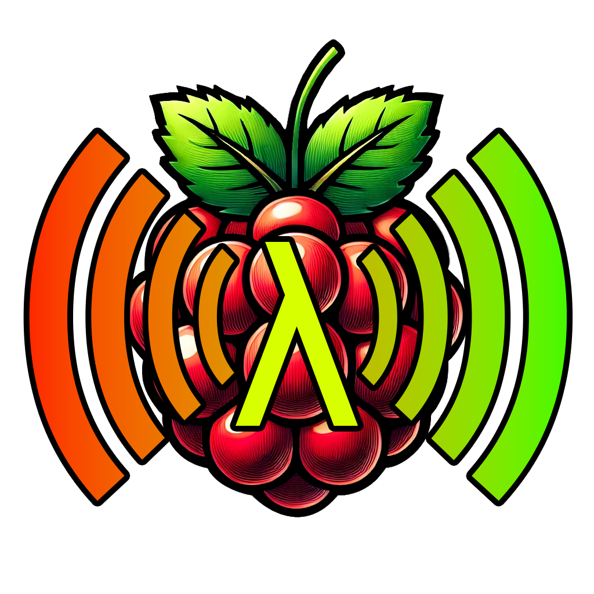
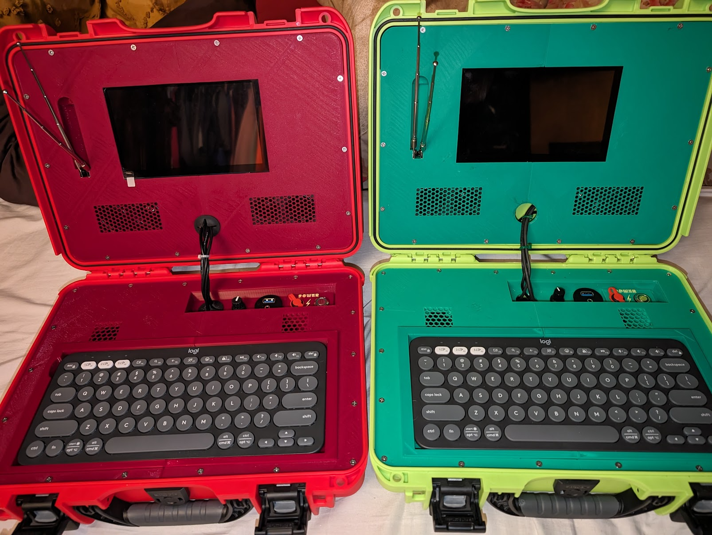

<div align="center">
  
  <h1 align="center">Lambda Cyberdeck 910</h1>
  <p align="center">
    A guide for building an SDR Cyberdeck within a compact Nanuk 910 case. Featuring a Raspberry Pi 4, 7-inch display, various I/O ports, and custom 3D printed hardware! The project includes step-by-step instructions for assembly and setup, with room for customization.
  </p>
  <p align="center">
    This is the product of a few months of tinkering and having fun with the Raspberry Pi 4 and RTL-SDR. I wanted to create a portable cyberdeck that could be used for a variety of tasks, including software-defined radio (SDR) and general computing. Now that it's completed, I would like to share this project with the world, so others can enjoy it as well!
  </p>
</div>

<!---------------------------------------------------------------------------->
<!---------------------------------------------------------------------------->
<!---------------------------------------------------------------------------->

### Index <a name="index"></a>

- [Images](#images)
- [Hardware](#hardware)
  - [Purchase](#purchase)
  - [Essential Parts List](#essential-parts-list)
  - [Optional Parts List](#optional-parts-list)
  - [3D Printed Parts List](#3d-printed-parts-list)
- [Assembly](#assembly)
  - [Top Panel](#top-panel-assembly)
  - [Bottom Panel](#bottom-panel-assembly)
  - [Keyboard Tray](#keyboard-tray-assembly)
- [Setup](#setup)
  - [Raspberry Pi SD Card](#raspberry-pi-sd-card-setup)
  - [Cooling Fan](#cooling-fan-setup)
  - [LCD Screen](#lcd-screen-setup)
  - [Rotary Encoder](#rotary-encoder-setup)
- [Licensing](#licensing)
- [Wrapping Up](#wrapping-up)

<!---------------------------------------------------------------------------->
<!---------------------------------------------------------------------------->
<!---------------------------------------------------------------------------->

## Images <a name="images"></a>

<p align="center">
  
  
</p>

<p align="right">[ <a href="#index">Index</a> ]</p>

<!---------------------------------------------------------------------------->
<!---------------------------------------------------------------------------->
<!---------------------------------------------------------------------------->

## Hardware <a name="parts-list"></a>

### Purchase <a name="purchase"></a>

Occasionally you may find a Lambda Cyberdeck for sale on https://www.lambda.guru or https://www.etsy.com/shop/LambdaGuru. I don't intend to make money on this project though, I just want to share it with the world for others to enjoy. If you want to build your own, I've provided all the information and files you need to get started below!

### Essential Parts List <a name="essential-parts-list"></a>

A list of essential parts needed to build the Lambda Cyberdeck:

| Part Name                                          |
| -------------------------------------------------- |
| Nanuk 910 Case                                     |
| Raspberry Pi 4 Model B/4GB                         |
| 64 GB MicroSD Card - Class 10                      |
| 7inch HDMI LCD (H) Display 1024x600, IPS           |
| Logitech Pebble Keys 2 K380s Bluetooth Keyboard    |
| RTL-SDR V4                                         |
| HighPi Pro 5V Cooling Fan                          |
| On/Off Button/Switch                               |
| USB-C Power Supply, 5.1V 3.0A                      |
| Waveshare 8Ω 5W Speakers                           |
| Micro-HDMI to HDMI cable                           |
| Rotary Encoder                                     |
| Female USB Type-C Mount to Male adaptor (power in) |
| M3 Screws and Nuts                                 |

### Optional Parts List <a name="optional-parts-list"></a>

A list of optional parts to give you some ideas for your build:

| Part Name              |
| ---------------------- |
| Portable Power Bank    |
| Wireless Mouse         |
| USB 2.0 / USB 3.0 Port |
| USB-C Port             |
| AUX Port               |
| Wire Shrink Wrap       |
| Rubber Grommits        |
| Case Lock(s)           |

### 3D Printed Parts List <a name="3d-printed-parts-list"></a>

A list of 3D printed parts needed to build the Lambda Cyberdeck:

| Part           | Material Cost | Print Time |
| -------------- | ------------- | ---------- |
| Innards        | 48g           | 05H 25M    |
| Top Left       | 90g           | 09H 51M    |
| Top Right      | 74g           | 07H 53M    |
| Bottom Left    | 126g          | 13H 15M    |
| Bottom Right   | 114g          | 12H 05M    |
| Tray Left      | 147g          | 11H 56M    |
| Tray Right     | 147g          | 11H 49M    |
| Tray Mini Rods | 1g            | 00H 07M    |

![3D Print Preview][img-3d]

Download: [3mf][download-full-3mf] | [stl][download-full-stl] | [view][view-full-stl]

**Percentage of 1kg spool used:** 74.7%

**Total grams of PLA filament:** 747g

**Total Print Time:** 72H 21M (4341 Minutes)

**Estimated Electricity Usage:** 21.705 kilowatt-hours

<p align="right">[ <a href="#index">Index</a> ]</p>
  
<!---------------------------------------------------------------------------->
<!---------------------------------------------------------------------------->
<!---------------------------------------------------------------------------->

## Assembly <a name="assembly"></a>

### Top Panel <a name="top-panel-assembly"></a>

Seperated into two large panel to be able to print in smaller 3D printers, the top panels can easily be combined with screws and nuts. One could also use glue to combine the two pieces together or modify the design to be a single piece.

- Use 5 - 12mm M3 screws and nuts to combine left and right panels together in the middle.
- Use 4 - 6mm M3 flat head screws to secure screen to the middle of the left and right panels.
- Use 8 - 6mm M3 screws with washers to secure the speakers to the left and right panels.
- Use 2 - 12mm M3 screws and nuts to secure the antennas into the right side panel.
- Use 14 - 6-12mm flat head M3 screws to attach the top panel into the case.

### Bottom Panel <a name="bottom-panel-assembly"></a>

The bottom panels are also seperated into two large pieces to be able to print in smaller 3D printers.

- Use 3 - 12mm M3 screws and nuts to combine left and right panels together in the middle.
- Use 9 - 16mm M3 screws and nuts to attach the port tray to the bottom panel.
- Use 4 - 6mm M3 screws to attach the Raspberry Pi to the bottom panel.
- Use 18 - 6-12mm flat head M3 screws to attach the bottom panel into the case.

### Keyboard Tray <a name="keyboard-tray-assembly"></a>

The keyboard tray is designed to hold a Logitech Pebble Keys 2 K380s Bluetooth Keyboard perfectly, including its slope. The tray is seperated into two large pieces to again be able to print in smaller 3D printers. but could be combined into one peice if desired.

- Use 3 - 8mm (less than 3mm radius) small 3D printed rods to combine left and right pieces together in the middle, glue.
- Use 3 - 152.4mm (6") (less than 6.5mm radius) wooden dowels to combine left and right pieces together in the middle, glue.

<p align="right">[ <a href="#index">Index</a> ]</p>
  
<!---------------------------------------------------------------------------->
<!---------------------------------------------------------------------------->
<!---------------------------------------------------------------------------->

## Setup <a name="setup"></a>

### Raspberry Pi SD Card <a name="raspberry-pi-sd-card-setup"></a>

- Download the Raspberry Pi Imager: https://www.raspberrypi.com/software/

- Install Raspberry Pi OS image on your microSD card.

### LCD Screen <a name="lcd-screen-setup"></a>

[7inch HDMI LCD (H) Display, 1024x600, IPS][link-lcd]

- Open the config.txt file in the root directory of the SD card.

- Add the following lines to the end of config.txt:

  ```
  hdmi_force_hotplug=1
  config_hdmi_boost=10
  hdmi_group=2
  hdmi_mode=87
  hdmi_cvt 1024 600 60 6 0 0 0
  ```

- Save and eject the SD card safely.

### Initial System Setup

Run the following commands to update the Raspberry Pi OS and firmware:

```bash
# Update package lists
sudo apt update

# Upgrade all installed packages
sudo apt full-upgrade

# Update the firmware
sudo rpi-update

# Reboot the Raspberry Pi
sudo reboot
```

### Cooling Fan <a name="cooling-fan-setup"></a>

[HighPi Pro 5V Cooling Fan][link-fan]

| Fan   | Raspberry Pi 4  |
| ----- | --------------- |
| Red   | Pin 4 (5V)      |
| Black | Pin 6 (GND)     |
| Blue  | Pin 8 (GPIO 14) |

Once you have connected your fan, by default it will be on whenever your Raspberry Pi is running. You can configure it to turn on only when your Raspberry Pi reaches a temperature that you choose.

Using a recent version of Raspberry Pi OS, first update to retrieve any recent changes to the operating system:

1. Open the Terminal, either from the **Start** menu (click the Raspberry Pi icon in the top left corner) or by pressing **Control + Alt + T**.

2. Type `sudo apt update` and then, when the update has finished, type `sudo apt full-upgrade`.

Then open the Raspberry Pi Configuration tool:

1. Click on the Raspberry Pi icon in the top left corner and select **Preferences** then **Raspberry Pi Configuration**.

2. Select the **Performance** tab.

3. Next to **Fan**, click **Enabled**.

4. If you have connected your fan as shown above, the default of **14** for **Fan GPIO** does not need to be changed.

5. Select the **Fan Temperature** at which you want your fan to turn on. The default is 80°C, which will stop the Raspberry Pi throttling on difficult tasks without having the fan on all the time.

### SDR Setup

1. Run the following scripts at the root `/` directory to install the RTL-SDR drivers:

   ```bash
   echo "Removing any existing rtl-sdr-blog directory..."
   [ -d rtl-sdr-blog ] && rm -rf rtl-sdr-blog

   echo "Removing existing RTL-SDR packages..."
   sudo apt purge ^librtlsdr
   sudo rm -rvf /usr/lib/librtlsdr* /usr/include/rtl-sdr* /usr/local/lib/librtlsdr* /usr/local/include/rtl-sdr* /usr/local/include/rtl_* /usr/local/bin/rtl_*

   echo "Updating and upgrading system packages..."
   sudo apt update
   sudo apt upgrade -y

   echo "Installing RTL-SDR software..."
   sudo apt-get install libusb-1.0-0-dev git cmake pkg-config
   git clone https://github.com/rtlsdrblog/rtl-sdr-blog
   cd rtl-sdr-blog
   mkdir build
   cd build
   cmake ../ -DINSTALL_UDEV_RULES=ON
   make
   sudo make install
   sudo cp ../rtl-sdr.rules /etc/udev/rules.d/
   sudo ldconfig

   echo 'blacklist dvb_usb_rtl28xxu' | sudo tee --append /etc/modprobe.d/blacklist-dvb_usb_rtl28xxu.conf
   ```

2. Copy the file `sdr-plus-plus-install.sh` to the `/home/<USER>` folder.

3. Open home directory `/home/<USER>`, then run the file `sdr-plus-plus-install.sh` to install the SDR++ software: Double click on the file and select `Run in Terminal`. This process will take about 20 minutes to complete and you must be connected to the internet.

Note if you get an error "etc/sudoers.d/010_pi-nopasswd:1:8: syntax error Mr Red ALL=(ALL) NOPASSWD: ALL" running these scripts run `sudo visudo -f /etc/sudoers.d/010_pi-nopasswd` and update line to "mr-red ALL=(ALL) NOPASSWD: ALL". You might have to rerun the scripts after this.

4. Reboot the system.

5. Run the software by clicking on the **Start** menu, then **Other**, and then **SDR++**. Right click on the icon and select **Add to Desktop** to create a shortcut on the desktop for easy access.

6. When you run the software it might be too big for the screen, use the keyboard shortcut `F11` to shrink it to full screen. Using the Logitch Pebble Keys 2 K380s, make sure to enable the F keys by pressing `Fn + Esc`.

7. In SDR++ set the source to `RTL-SDR` and the default gain to `14.4 dB`.

An example for finding an FM station steps would be:

1. Set the frequency to `97.7 MHz` (a local FM station frequency).

2. Set the mode to `WFM`.

3. Set the bandwidth to `200 kHz`.

### Rotary Encoder <a name="rotary-encoder-setup"></a>

[Rotary Encoder][link-rotary-encoder]

| Rotary Encoder | Raspberry Pi 4   |
| -------------- | ---------------- |
| S1             | Pin 37 (GPIO 26) |
| S2             | Pin 39 (GND)     |
| A              | Pin 31 (GPIO 6)  |
| B              | Pin 29 (GPIO 5)  |
| C              | Pin 25 (GND)     |

```bash
# ROTARY ENCODER PINOUT

|-[ S1 ]-[ S2 ]-|
|...BOTTOM.OF...|
|....ROTARY.....|
|....ENCODER....|
|-[A]--[C]--[B]-|

# RASPERRY PI 4B PINOUT
                   -----------
       3V3 Power - | 01 | 02 | - 5V Power
   GPIO 2 (SDA1) - | 03 | 04 | - 5V Power
   GPIO 3 (SCL1) - | 05 | 06 | - GND
  GPIO 4 (GCLK0) - | 07 | 08 | - GPIO 14 (TXD)
             GND - | 09 | 10 | - GPIO 15 (RXD)
         GPIO 17 - | 11 | 12 | - GPIO 18 (PCM_CLK)
         GPIO 27 - | 13 | 14 | - GND
         GPIO 22 - | 15 | 16 | - GPIO 23
       3V3 Power - | 17 | 18 | - GPIO 24
  GPIO 10 (MOSI) - | 19 | 20 | - GND
   GPIO 9 (MISO) - | 21 | 22 | - GPIO 25
  GPIO 11 (SCLK) - | 23 | 24 | - GPIO 8 (CE0)
             GND - | 25 | 26 | - GPIO 7 (CE1)
  GPIO 0 (ID_SD) - | 27 | 28 | - GPIO 1 (ID_SC)
          GPIO 5 - | 29 | 30 | - GND
          GPIO 6 - | 31 | 32 | - GPIO 12 (PWM0)
  GPIO 13 (PWM1) - | 33 | 34 | - GND
GPIO 19 (PCM_FS) - | 35 | 36 | - GPIO 16
         GPIO 26 - | 37 | 38 | - GPIO 20 (PCM_DIN)
             GND - | 39 | 40 | - GPIO 21 (PCM_DOUT)
                   -----------
```

1. Copy the following files from the `Scripts`:

- `rotary_encoder.py` - Python script to read the rotary encoder and send input to the system.

- `rotary_encoder.service` - Systemd service file to run the script on startup.

These scripts will be initially copied to `/home/<USER>/Scripts` and then moved to `/etc/systemd/system/` to run on startup.

```bash
# Create a new directory for the scripts IN `/home/<USER>/Scripts`
mkdir ~/Scripts

# Copy the Scripts folder from the USB Flash Drive to the Raspberry Pi
cp -r /media/<USER>/<USB>/Scripts ~/
```

3. Open a terminal and navigate to the new `~/Scripts` directory:

```bash
cd ~/Scripts
```

4. Run the following command to make the rotary_encoder.py script executable:

```bash
sudo chmod +x rotary_encoder.py
```

5. Open the file `rotary_encoder.service` and replace `<USER>` with your username.

6. Copy the rotary_encoder.service file to the /etc/systemd/system/ directory:

```bash
sudo cp rotary_encoder.service /etc/systemd/system/
```

7. Run the following to install and update all assets needed for these new scripts to run:

```bash
# Update package lists
sudo apt update

# Install Python 3, pip3, and the required packages
sudo apt install -y python3 python3-pip python3-pigpio

# Enable and start the pigpio daemon
sudo systemctl enable pigpiod
sudo systemctl start pigpiod

# Install evdev in the global Python environment

sudo apt install python3-evdev

# sudo pip3 install evdev # ERROR

sudo chown <USER>:<USER> /home/<USER>/Scripts/rotary_encoder.py
sudo chmod +x /home/<USER>/Scripts/rotary_encoder.py

# Add the <USER> to the input group to grant access to `/dev/uinput`.
sudo usermod -aG input <USER>

# Create a udev rule to set the correct permissions for `/dev/uinput`.
# This ensures that the device file has the necessary permissions every time the system boots.
sudo nano /etc/udev/rules.d/99-uinput.rules

# Add the following line to the file.
# Save and exit the file (Ctrl + X, then Y, then Enter).
KERNEL=="uinput", MODE="0660", GROUP="input"

# Reload the udev rules to apply the changes
sudo udevadm control --reload-rules
sudo udevadm trigger

# Add User to input Group
sudo usermod -aG input <USER>

# Reboot the System
sudo reboot
```

8. Run the following command to enable the service to run on startup:

```bash
sudo systemctl enable rotary_encoder.service
```

9. Run the following command to start the service immediately:

```bash
sudo systemctl start rotary_encoder.service
```

10. Run the following command to check the status of the service:

```bash
sudo systemctl status rotary_encoder.service
```

Note: To stop the service, run the following command:

```bash
sudo systemctl stop rotary_encoder.service
```

<p align="right">[ <a href="#index">Index</a> ]</p>
  
<!---------------------------------------------------------------------------->
<!---------------------------------------------------------------------------->
<!---------------------------------------------------------------------------->

## Licensing <a name="licensing"></a>

This project is licensed under the **Creative Commons Attribution-NonCommercial 4.0 International (CC BY-NC 4.0)** License. See the [LICENSE.md](LICENSE.md) file for the pertaining license text.

`SPDX-License-Identifier: CC-BY-NC-4.0`

<p align="right">[ <a href="#index">Index</a> ]</p>

<!---------------------------------------------------------------------------->
<!---------------------------------------------------------------------------->
<!---------------------------------------------------------------------------->

## Wrapping Up <a name="wrapping-up"></a>

Thanks for checking out my Lambda Cyberdeck project! I hope you found this guide helpful and you had fun building your own cyberdeck. I had a lot of fun figuring all of this out and getting all put together, and may create more in the future. If you have any questions or need help with your build, feel free to reach out to me.

| Type                                                                      | Info                                                           |
| :------------------------------------------------------------------------ | :------------------------------------------------------------- |
|                 | webmaster@codytolene.com                                       |
|            | https://github.com/sponsors/CodyTolene                         |
|      | https://www.buymeacoffee.com/codytolene                        |
|  | bc1qfx3lvspkj0q077u3gnrnxqkqwyvcku2nml86wmudy7yf2u8edmqq0a5vnt |

Fin. Have a good day friend!

Cody Tolene

<!---------------------------------------------------------------------------->
<!---------------------------------------------------------------------------->
<!---------------------------------------------------------------------------->

<!-- IMAGE REFERENCES -->
[img-3d]: .github/images/previews/3d.png
[img-info]: .github/images/ng-icons/info.svg
[img-warning]: .github/images/ng-icons/warn.svg

<!-- LINK REFERENCES -->

[link-fan]: https://www.pishop.us/product/highpi-pro-5v-cooling-fan/
[link-lcd]: https://www.pishop.us/product/7inch-hdmi-lcd-h-display-1024x600-ips/
[link-rotary-encoder]: https://www.pishop.us/product/rotary-encoder-extras/

<!-- DOWNLOADS -->

[download-full-3mf]: https://github.com/CodyTolene/Lambda-Cyberdeck-910/raw/main/Lambda_Cyberdeck_910.3mf
[download-full-stl]: https://github.com/CodyTolene/Lambda-Cyberdeck-910/raw/main/Lambda_Cyberdeck_910.stl
[view-full-stl]: https://github.com/CodyTolene/Lambda-Cyberdeck-910/blob/main/Lambda_Cyberdeck_910.stl
